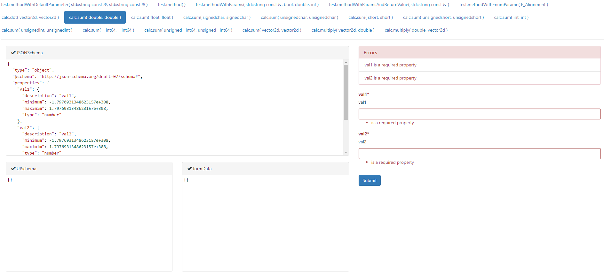
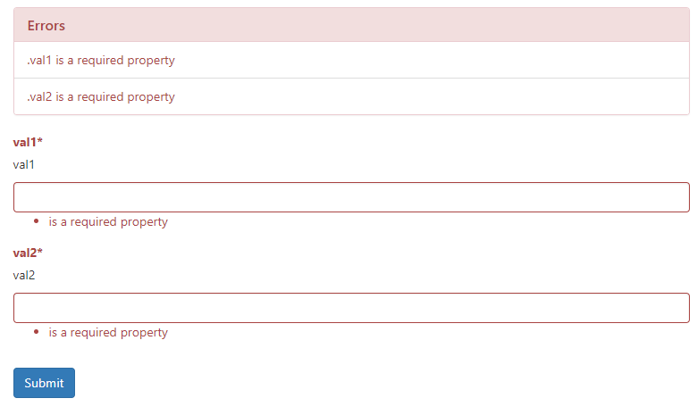
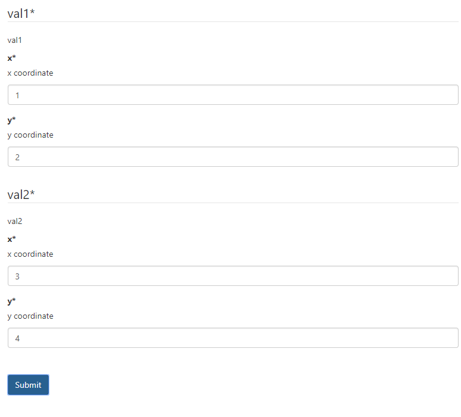
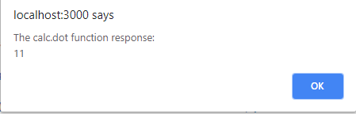

# RTTR-RPC
JSON-RPC server built with C++ runtime reflection

- [RTTR-RPC](#rttr-rpc)
  - [Overview](#overview)
  - [Motivation](#motivation)
    - [C++ reflection](#c-reflection)
    - [C++ object binding to JSON-RPC service](#c-object-binding-to-json-rpc-service)
    - [JavaScript client using rpc-web-channel](#javascript-client-using-rpc-web-channel)
    - [Automatic UI forms generation](#automatic-ui-forms-generation)
  - [Components](#components)
  - [Build](#build)
    - [Build RTTR](#build-rttr)
    - [Build RTTR-RPC](#build-rttr-rpc)
  - [References](#references)

## Overview
RTTR-RPC is a JSON-RPC framework built on top of [RTTR](http://rttr.org) C++ reflection library, which allows binding of existing C++ object to a JSON-RPC service. RTTR-RPC uses [JSON Schema Service Descriptor](https://jsonrpc.org/historical/) for providing a service discovery functionality. [rpc-web-channel.js](https://github.com/kdeyev/rpc-web-channel) uses the JSON Schema Service Descriptor for  JavaScript stubs generating in run-time and uses [JSON Schema](https://json-schema.org) for UI form generation.

## Motivation

### C++ reflection
You have a sctuct:
~~~~~~~~~~~c++
struct Calculator {
    Calculator(){};
    double sum(double val1, double val2) {
        return val1 + val2;
    };
};
~~~~~~~~~~~
You add a reflection to your class using non-intrusive sintax:
~~~~~~~~~~~c++
RTTR_REGISTRATION {
    rttr::registration::class_<Calculator>("Calculator")(
        // class meta data
        rttr::metadata(rttr_rpc::meta_data_type::thread_safe, true), 
		rttr::metadata(rttr_rpc::meta_data_type::description, "Calculator service obj"),
        rttr::metadata(rttr_rpc::meta_data_type::version, "7.0")
	)
    
    .method("sum", rttr::select_overload<double(double, double)>(&Calculator::sum))(
    	rttr::parameter_names("val1", "val2"),
    	rttr::metadata(rttr_rpc::meta_data_type::description, "Summation of scalars")
    );
}
~~~~~~~~~~~
### C++ object binding to JSON-RPC service
Bind an existing struct instance to RTTR-RPC service repository:
~~~~~~~~~~~c++
// service repository
rttr_rpc::core::repository repo;

// an instance of your service
Calculator calc;

// bind the object to the service repository
 repo.add_service("calc", calc);
~~~~~~~~~~~

invoke the object method using JSON-RPC request
~~~~~~~~~~~c++
// example of JSON-RPC request
auto request = std::make_shared <jsonrpc::request> (3, "calc.sum", R"([42.0,24.0])");

// process the JSON-RPC request
auto response = repo.process_message(request);
~~~~~~~~~~~
It's also allowed to used named aruments:
~~~~~~~~~~~c++
// example of JSON-RPC request with named arguments
auto request = std::make_shared <jsonrpc::request> (3, "calc.sum", R"({"val1": 42.0, "val2": 24.0)");

// process the JSON-RPC request
auto response = repo.process_message(request);
~~~~~~~~~~~
### JavaScript client using rpc-web-channel
rpc-web-channel uses the JSON Schema Service Descriptor for building JS stubs on client side
~~~~~~~~~~~javascript
new RpcWebChannel(jrpc, function(services) {
    let calc = services.calc;

    calc.sum(42.0, 24.0).then(function (result) {
        // do something with the result
    });
};
~~~~~~~~~~~
### Automatic UI forms generation
This example shows how to generate UI forms for RPC functions exposed by the RpcWebChannel server.
The example utilizes the [JSON Schema Service Descriptor](https://jsonrpc.org/historical/json-schema-service-descriptor.html) format for discovering service list on a specific RpcWebChannel server and uses the [React Jon Schema Form](https://github.com/mozilla-services/react-jsonschema-form) for the UI forms generation. A generated UI Form allows specifying parameter values and invokes a server-side method using RpcWebChannel.

An example of generated form:

Parameter values validation
calc_dot
Composite parameters:

Server invocation

## Components

* [RTTR-RPC::io](https://github.com/kdeyev/rttr_rpc/tree/master/src/io) - JSON serialization/deserialization mechanism build on top of [RTTR](http://rttr.org) reflection. This component actively used by [RTTR-RPC::core](https://github.com/kdeyev/rttr_rpc/tree/master/src/core)
* [RTTR-RPC::jsonrpc](https://github.com/kdeyev/rttr_rpc/tree/master/src/jsonrpc) - base infrastructure of JSON-RPC messages.
 * [RTTR-RPC::core](https://github.com/kdeyev/rttr_rpc/tree/master/src/core) - JSON-RPC layer based on top of rttr reflection and [RTTR-RPC::io](https://github.com/kdeyev/rttr_rpc/tree/master/src/io) serialization 
 * [RTTR-RPC::beast](https://github.com/kdeyev/rttr_rpc/tree/master/src/beast) - JSON-RPC HTTP/WebSocket server implementation using [Boost.Beast](https://github.com/boostorg/beast)  
* [rpc-web-channel.js](https://github.com/kdeyev/rpc-web-channel) - JavaScript layer over simple-jsonrpc-js which uses the JSON Schema Service Descriptor for building JS stubs on client side. 

## Build
### Build RTTR 
1. cd 3rd_party/rttr
2. mkdir build && cd mkdir
3. cmake -DCMAKE_INSTALL_PREFIX:PATH=../install -G "Visual Studio 15 2017 Win64" ..
4. cmake --build . --target install

### Build RTTR-RPC
1. mkdir build && cd mkdir
2. cmake -G "Visual Studio 15 2017 Win64" ..
3. cmake --build . --target install

## References
* [RTTR](http://rttr.org)
* [JSON for Modern C++](https://github.com/nlohmann/json)
* [JSON Schema](https://json-schema.org)
* [JSON Schema Service Descriptor](https://jsonrpc.org/historical/)
